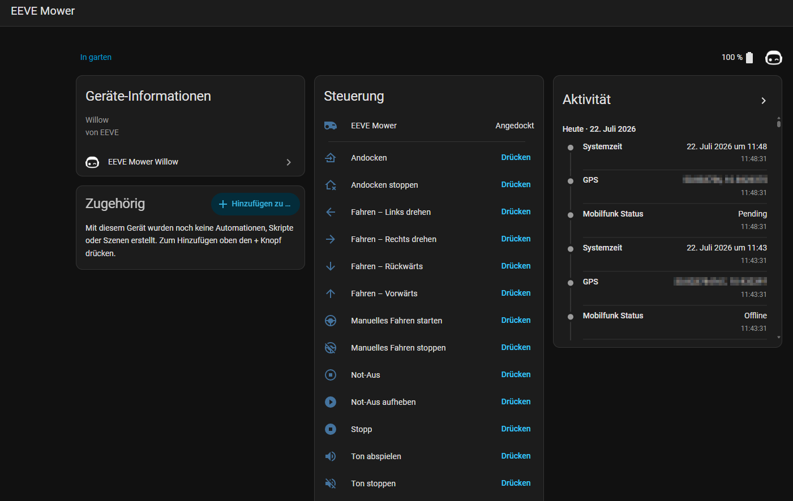
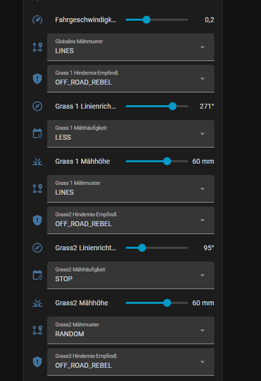

# EEVE Mower Willow Integration for Home Assistant

Control and monitor your **EEVE Mower Willow** robot lawn mower directly from Home Assistant.
The integration talks to the mower's local REST API (`http://<mower-ip>:8080`) — no cloud required (`local_polling`).

It provides a full Home Assistant **lawn mower entity** (start / pause / dock), per-zone and global mowing
settings, manual driving, map exploration, maintenance actions and a large set of status and diagnostic sensors.
All entities have translated names (English / German) and language-independent entity IDs.

---

## Features

- **Lawn mower entity** – start mowing, pause and dock straight from the mower card.
- **Zone control** – pick the zone to mow, or configure each zone individually.
- **Per-zone settings** – mowing pattern, mowing frequency, obstacle sensitivity, cutting height and line-mowing direction for every grass zone.
- **Rename zones from Home Assistant** – every grass zone has a text entity; type a new name and it is written to the mower.
- **Zones appear without a restart** – add or clone a zone and its settings entities are created immediately.
- **"All zones" shortcuts** – set mowing pattern, frequency, obstacle sensitivity, cutting height or line direction for **all zones at once**.
- **Global mowing settings** – global pattern, frequency, mowing speed (m²/h), person-scanning behaviour, max mowing time, start time after sunrise.
- **Manual driving** – forward, backward, turn left/right, with adjustable drive speed.
- **Map exploration** – build map, start/stop/finish/abort exploration, auto-align maps.
- **Safety & maintenance** – emergency stop + release, reboot, shutdown, clear rain sensor, retry docking, resume tool planner, reset heatmap.
- **Scheduling** – enable/disable mowing per weekday, StarLight beacons, auto annotation.
- **Status sensors** – battery, activity, current mowing zone, session/today/total mowing time, docking & charge state, rain sensor, and more.
- **Diagnostics** – network (WiFi/mobile), hardware & firmware versions, motor controller, GPS, disk usage, camera calibration.
- **Live camera** – the mower's front camera as a Home Assistant camera entity.
- **Zone geometry API** – the `save_zones` service writes zone GeoJSON back to the mower, which powers the companion map card.
- **Localized** – full English and German translations; the device page is grouped into *Controls*, *Configuration* and *Diagnostic* sections.

---

## Installation

### HACS (recommended)

1. Open **HACS** in Home Assistant.
2. Menu (⋮) → **Custom repositories**.
3. Add the URL `https://github.com/flame4ever/eeve_mower_willow` with category **Integration**.
4. Search for **EEVE Mower Willow** and install it.
5. Restart Home Assistant.

### Manual

1. Copy the `eeve_mower_willow` folder into `config/custom_components/`.
2. Restart Home Assistant.

**Requirements:** Home Assistant **2024.1.0** or newer, and the mower reachable on your local network.

---

## Configuration

1. Go to **Settings → Devices & Services → Add Integration**.
2. Search for **EEVE Mower Willow**.
3. Enter a **mower name** and the **IP address** of your mower (e.g. `192.168.1.23`).
4. Submit — the entities are created automatically.

---

## Provided entities

Entity IDs are shown with the device prefix `eeve_mower` (your mower's name may differ). Names are localized.

### Lawn mower & camera
- `lawn_mower.eeve_mower` – main mower entity (Start / Pause / Dock)
- `camera.mower_camera` – front camera live image

### Controls (buttons)
- Emergency stop / release emergency stop
- Manual drive: start, stop, forward, backward, turn left, turn right
- Docking: start docking, stop docking, retry docking
- Stop (halt current navigation), play sound, stop sound

### Configuration (selects, numbers, switches)
- **Global:** mowing zone, mowing speed, global mowing pattern, mowing frequency, obstacle sensitivity, person scanning, show emotion
- **Per zone (× each grass zone):** mowing pattern, mowing frequency, obstacle sensitivity, mower height, line direction
- **All zones:** mower height, line direction, mowing pattern, mowing frequency, obstacle sensitivity
- **Numbers:** max mowing time, manual drive speed, start time after sunrise, volume, low battery threshold
- **Switches:** mow on Monday … Sunday, StarLight beacons, auto annotation
- **Maintenance buttons:** reboot, shutdown, clear rain sensor, build map, start/stop/finish/abort exploration, auto-align maps, resume tool planner, reset heatmap
- **Text:** mower name, plus one *name* entity per grass zone for renaming

### Sensors
- Battery, activity, scheduler, tool planner status
- Zone map (zone layout, used by the map card)
- Current mowing zone, session / today / total mowing time, today end time
- Docking state, charge status, charger state, charging current & power
- Rain sensor, last rain

### Diagnostics (disabled by default where noisy)
- Network: state, WiFi (SSID, signal, IP, state), mobile (state, reason)
- Hardware & firmware versions, serial number, mower type
- Motor controller (firmware, hardware, serial, type, uptime), blade RPM
- GPS, boot count, exploring state, disk capacity/free, SLAM odometry, distances
- Binary sensors: is mowing, is docked, is charging, is returning, has error, is recording map, camera lens calibrated

---

## Services

The integration registers two services (Developer Tools → Actions):

### `eeve_mower_willow.drive`

Drives the mower manually (requires manual driving mode). If the mowing motor was running before the
manoeuvre, it is re-engaged afterwards.

| Field | Description |
| --- | --- |
| `action` | `forward`, `backwards`, `spin` or `stop` (required) |
| `speed` | driving speed in m/s (default `0.2`) |
| `distance` | travel distance in m for `forward` / `backwards` (default `0.3`) |
| `turn_radius` | curve radius in m while driving, `0` = straight (default `0.0`) |
| `rotation` | rotation in degrees for `spin`, negative = left (default `0.0`) |
| `entry_id` | optional — target a specific mower if you have more than one |

Sends a single short movement; call it repeatedly for continuous driving. This is what the joystick in the
companion card does.

### `eeve_mower_willow.save_zones`

Writes a complete zone layout to the mower and refreshes the cached zone data. New or cloned zones become
Home Assistant entities right away — no restart needed.

| Field | Description |
| --- | --- |
| `geojson` | a GeoJSON `FeatureCollection` describing all zones |

This is the service the companion map card uses when you draw, clone or rename zones on the map.

---

## Companion cards

Two Lovelace cards build on top of this integration, each in its own HACS-installable repository:

- **[EEVE Mower Card](https://github.com/flame4ever/eeve_mower_willow_card)** (v0.3.0+) – `custom:eeve-mower-card`,
  a self-building control panel: live camera with status chips and the mower's AI detection overlays, joystick,
  all controls and every zone / global setting.
- **[EEVE Mower Map Card](https://github.com/flame4ever/eeve_mower_willow_map_card)** (v0.1.0+) –
  `custom:eeve-mower-map-card`, a satellite map of your mowing zones with the live mower position and an editor
  to draw, clone and rename zones.

---

## Upgrading from earlier versions

Existing entities are preserved on upgrade — their unique IDs are kept stable, so dashboards and automations
that reference battery, network, camera, reboot/stop and the other original entities keep working.

### Upgrading to v0.5.0

Nothing to do. The release only adds entities (one *name* entity per grass zone, plus `zone_map`) and the
`save_zones` service. `device_tracker.py`, which was never loaded and had no effect, was removed — GPS data
is unchanged and remains available via `sensor.gps`.

### Upgrading from pre-0.4 versions

Two things change and are **expected**:

- The old **`switch.start_mowing`** ("Start Mowing") and **`switch.go_back_to_the_dock`** ("Go back to the Dock")
  switches are replaced by the new `lawn_mower` entity (Start / Dock).
- The **"Stop Mowing" button** was removed (use the lawn mower's pause/dock, or the **Stop** button).

After the update these no longer-provided entities appear as *unavailable*; you can safely delete them from the
device page.

---

## Contributing

Contributions are welcome — please open an issue or pull request on GitHub.

## License

Licensed under the GNU General Public License v3.0. See the [LICENSE](LICENSE) file.

## Support

For support and questions, open an issue on the [GitHub repository](https://github.com/flame4ever/eeve_mower_willow/issues).
